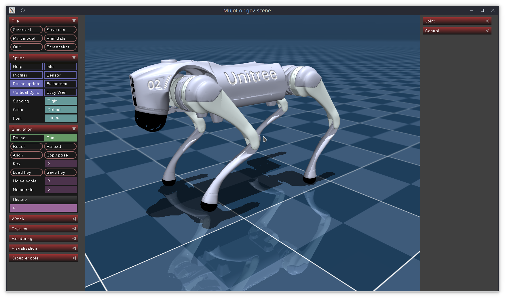

# GO2 Crawl

Unitree Go2 quadruped crawling locomotion using Dynamic Movement Primitives (DMP) optimized with multiple methods: CMA-ES, SAC, PPO, and ProPS/ProPS+ (LLM-based optimization).

Supports two trajectory modes:
- **PCA + DMP**: DMP operates in a 2D PCA latent space learned from keyframe poses, then maps back to 12 joints
- **Direct DMP**: DMP operates directly on all 12 joints with no dimensionality reduction



## Setup

```bash
# Clone the repository
git clone https://github.com/JnanaVSB/GO2_CRAWL.git
cd GO2_CRAWL

# Create and activate conda environment
conda create -n crawl_opt python=3.10 -y
conda activate crawl_opt

# Install dependencies
pip install -r requirements.txt
```

## Quick Start

```bash
# Train with CMA-ES using PCA+DMP (20 parameters)
python main.py --config configs/cmaes_bfs10.yaml

# Train with CMA-ES using direct DMP (120 parameters)
python main.py --config configs/cmaes_direct_bfs10.yaml

# Start fresh (clear previous checkpoints)
python main.py --config configs/cmaes_bfs10.yaml --fresh
```

Initial DMP weights are generated automatically on the first run if they don't exist.

## Training with Different Optimizers

```bash
# CMA-ES (evolutionary)
python main.py --config configs/cmaes_bfs10.yaml
python main.py --config configs/cmaes_direct_bfs10.yaml

# SAC (off-policy RL)
python main.py --config configs/sac_dmp_bfs10.yaml
python main.py --config configs/sac_direct_bfs10.yaml

# PPO (on-policy RL)
python main.py --config configs/ppo_dmp_bfs10.yaml
python main.py --config configs/ppo_direct_bfs10.yaml

# ProPS (LLM-based optimization, requires API key)
export OPENAI_API_KEY="your-key-here"
python main.py --config configs/props_dmp_bfs10.yaml

# ProPS+ (with semantic environment description)
python main.py --config configs/props_dmp_semantic_bfs10.yaml
```

## Visualization

```bash
# Generate all training graphs (reward curve, distance curve, PCA comparison, joint trajectories, weight evolution)
python viz.py --config configs/cmaes_bfs10.yaml --graphs

# Render the best result as MP4 + GIF
python viz.py --config configs/cmaes_bfs10.yaml --render

# Animate PCA trajectory evolution across checkpoints
python viz.py --config configs/cmaes_bfs10.yaml --pca_gif

# Combine multiple
python viz.py --config configs/cmaes_bfs10.yaml --graphs --render
```

PCA-related plots are automatically skipped when using direct DMP mode.

## Project Structure

```
GO2_CRAWL/
├── main.py                      # Entry point — reads config, dispatches to runner
├── viz.py                       # Visualization entry point
├── requirements.txt
│
├── configs/                     # YAML configs — one per experiment
│   ├── cmaes_bfs10.yaml         # CMA-ES + PCA+DMP
│   ├── cmaes_direct_bfs10.yaml  # CMA-ES + direct DMP
│   ├── sac_dmp_bfs10.yaml       # SAC + PCA+DMP
│   ├── sac_direct_bfs10.yaml    # SAC + direct DMP
│   ├── ppo_dmp_bfs10.yaml       # PPO + PCA+DMP
│   ├── ppo_direct_bfs10.yaml    # PPO + direct DMP
│   ├── props_dmp_bfs10.yaml     # ProPS + PCA+DMP
│   └── ...
│
├── trajectory/                  # Swappable trajectory generators
│   ├── base.py                  # TrajectoryGenerator ABC
│   ├── pca_dmp.py               # PCA + rhythmic DMP (2D latent → 12 joints)
│   └── direct_dmp.py            # Rhythmic DMP directly on 12 joints
│
├── evaluation/                  # Shared rollout + logging (no duplication)
│   ├── rollout.py               # evaluate_single() — used by all runners
│   └── logging.py               # Log headers, PCA plots, directory setup
│
├── runner/                      # Training loops — one per optimizer type
│   ├── evolutionary_runner.py   # CMA-ES loop
│   ├── sac_dmp_runner.py        # SAC loop
│   ├── ppo_dmp_runner.py        # PPO loop
│   └── props_dmp_runner.py      # ProPS/ProPS+ loop
│
├── agent/                       # Optimizers
│   ├── cmaes_agent.py           # CMA-ES wrapper
│   ├── sac_dmp_agent.py         # SAC via Stable-Baselines3
│   ├── ppo_dmp_agent.py         # PPO via Stable-Baselines3
│   ├── props_dmp_agent.py       # ProPS LLM-based optimizer
│   └── propsbuffernobias.py     # ProPS history buffer
│
├── env/                         # MuJoCo environment
│   ├── go2_env.py               # Go2CrawlEnv (Gymnasium interface)
│   ├── rewards.py               # Reward + termination functions
│   └── rewards1.py              # Alternative reward (unnormalized)
│
├── dmp/                         # Dynamic Movement Primitives library
│   ├── dmp.py                   # Base DMP class
│   ├── dmp_rhythmic.py          # Rhythmic DMP (used for crawling)
│   ├── dmp_discrete.py          # Discrete DMP
│   └── cs.py                    # Canonical system
│
├── data/                        # Datasets + saved weights
│   ├── new_dataset_v0.csv
│   ├── new_dataset_v1.csv
│   └── weights/
│
├── go2/                         # MuJoCo robot model
│   ├── scene.xml
│   ├── go2.xml
│   └── assets/
│
├── visualize/                   # Visualization utilities
│   ├── graphs.py                # Training plot generators
│   ├── render.py                # MuJoCo rollout renderer
│   └── pca_gif.py               # PCA trajectory animation
│
├── templates/                   # Jinja2 templates for ProPS prompts
│   ├── props_numeric.j2
│   ├── props_semantic.j2
│   └── go2_crawl_description.j2
│
├── datasetgen.py                # Tool for recording keyframe poses
└── results/                     # Auto-created per training run
```

## Config Structure

The trajectory mode is selected via the `trajectory.type` field in the config:

```yaml
trajectory:
  type: direct_dmp    # or "pca_dmp"
```

If the `trajectory` section is omitted, it defaults to `pca_dmp` for backward compatibility.

The `policy` section contains trajectory-specific parameters:

```yaml
# For PCA+DMP
policy:
  csv_path: data/new_dataset_v1.csv
  dmp_params_path: data/weights/dmp_params_newV1_bfs10.npz
  n_components: 2
  n_bfs: 10
  dmp_timesteps: 628

# For direct DMP
policy:
  csv_path: data/new_dataset_v1.csv
  dmp_params_path: data/weights/direct_dmp_params_bfs10.npz
  n_bfs: 10
  n_joints: 12
  dmp_timesteps: 628
```

## Adding a New Trajectory Method

1. Create `trajectory/your_method.py` inheriting from `TrajectoryGenerator`
2. Implement `generate_trajectory(weights_flat)` and `num_params`
3. Add it to `TRAJECTORY_REGISTRY` in `main.py` and `viz.py`
4. Create a config file with `trajectory.type: your_method`

## Adding a New Optimizer

1. Create `agent/your_agent.py` with the optimizer logic
2. Create `runner/your_runner.py` importing from `evaluation/rollout.py` and `evaluation/logging.py`
3. Add a dispatch case in `main.py`
4. Create a config file

## References

- DMP library adapted from [Travis DeWolf](https://github.com/studywolf/pydmps)
- ProPS: [Zhou et al., NeurIPS 2025](https://github.com/yfzhoucs/props-llm)
- Unitree Go2 MuJoCo model from [unitree_mujoco](https://github.com/unitreerobotics/unitree_mujoco)